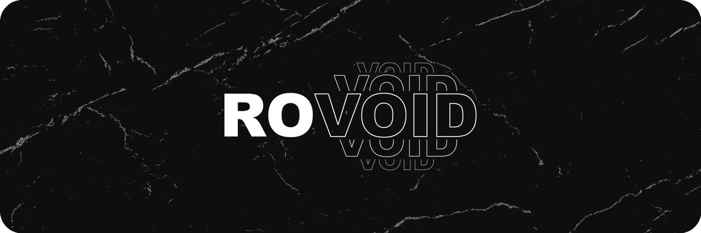

 

  

###

<h3 align="left">About Me</h3>

###

I'm a Full Stack Software Developer specializing in building scalable web applications, desktop software, and cross-platform mobile solutions. I focus on architecting resilient systems, writing maintainable code, and delivering seamless user experiences from the database layer to the client interface.

###

### Technical Stack

My core development expertise spans across modern web frameworks, strongly typed languages, and versatile backend environments.

* **Frontend:** TypeScript, JavaScript, React, Next.js, Tailwind CSS
* **Backend:** Node.js, PHP, Laravel, Python
* **Desktop:** Rust, Flutter
* **Mobile:** Flutter (Dart), Kotlin
* **Database:** MongoDB, SQL

### Multimedia & Technical Arts

Alongside traditional software engineering, I have practical experience in visual media, including building code-driven motion graphics with Remotion, as well as working in Unreal Engine, Adobe Premiere, and After Effects.

<h3 align="left">Language and tools</h3>

###

  &nbsp;&nbsp;&nbsp;&nbsp;&nbsp;&nbsp;&nbsp;&nbsp;&nbsp;&nbsp;&nbsp;&nbsp;&nbsp;&nbsp;&nbsp;&nbsp;&nbsp;&nbsp;&nbsp;&nbsp;&nbsp;&nbsp;&nbsp;&nbsp;&nbsp;&nbsp;&nbsp;&nbsp;&nbsp;&nbsp;&nbsp;&nbsp;&nbsp;&nbsp;&nbsp;&nbsp;&nbsp;&nbsp;&nbsp;&nbsp;&nbsp;&nbsp;&nbsp;&nbsp;&nbsp;&nbsp;&nbsp;&nbsp;&nbsp;&nbsp;&nbsp;&nbsp;&nbsp;&nbsp;&nbsp;&nbsp;&nbsp;&nbsp;&nbsp;&nbsp;&nbsp;&nbsp;&nbsp;&nbsp;&nbsp;&nbsp;&nbsp;&nbsp;&nbsp;&nbsp;&nbsp;&nbsp;

###

<h3 align="left">My Services</h3>

###

  

###

<h4 align="left">Other Services</h4>

###

  

###

<h3 align="left">My Stats :</h3>

###

  &nbsp;&nbsp;&nbsp;&nbsp;&nbsp;&nbsp;
  
  

###

<h3 align="left">Support My Work</h3>

###

If you find my projects and work useful, please consider a donation. As I am based in Iran, cryptocurrency is the only way I can receive support. Thank you!

| Cryptocurrency | Address |
| :--- | :--- |
| **Bitcoin** (BTC) | `bc1qd35yqx3xt28dy6fd87xzd62cj7ch35p68ep3p8` |
| **Ethereum** (ETH) | `0xA39Dfd80309e881cF1464dDb00cF0a17bF0322e3` |
| **USDT** (TRC20) | `THMe6FdXkA2Pw45yKaXBHRnkX3fjyKCzfy` |
| **Solana** (SOL) | `9QZHMTN4Pu6BCxiN2yABEcR3P4sXtBjkog9GXNxWbav1` |
| **TON** | `UQCp0OawnofpZTNZk-69wlqIx_wQpzKBgDpxY2JK5iynh3mC` |
